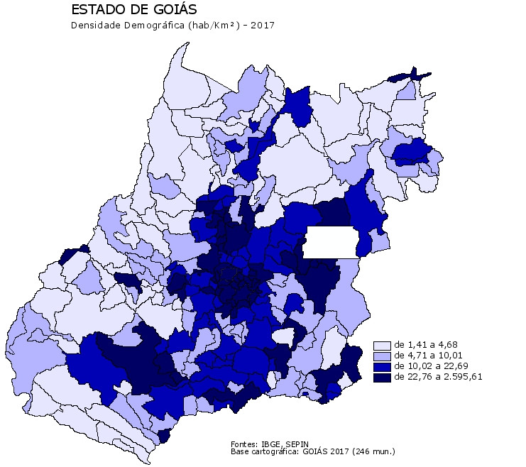
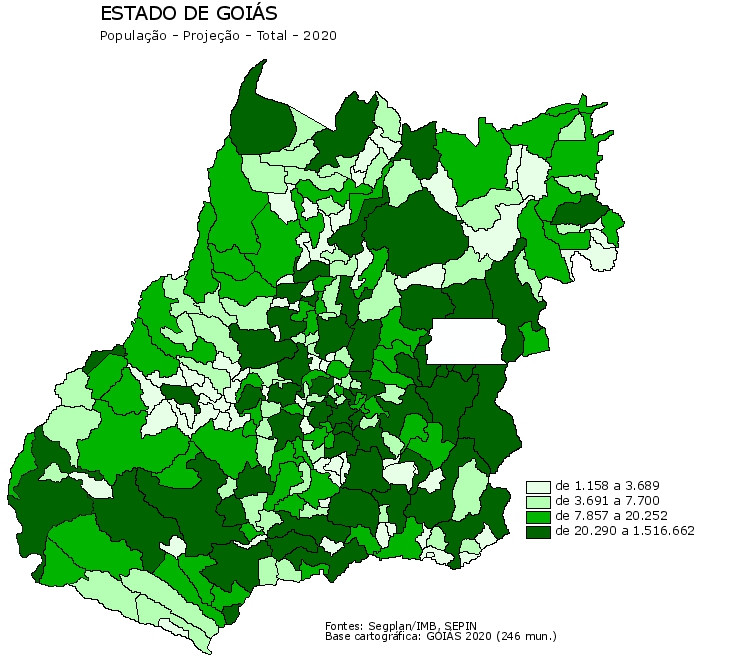

# Anexo A

Método dos quartis: Este método constrói grupos de municípios de forma que para cada um deles correspondem aproximadamente 25% dos municípios, ou seja, o Estado é dividido em 4 grupos de municípios.

## Aspectos Demográficos e Sociais

### Densidade Demográfica

É o indicador que mostra como a população se distribui pelo território, sendo determinada pela razão entre a população e a área de uma determinada região. É um índice utilizado para verificar a intensidade de ocupação de um território.

### População

#### Projeções

##### Total

População projetada para os anos de 2011 a 2020 foi obtida pelo método das componentes demográficas para o nível estadual e pelo método AiBi para nível municipal.

